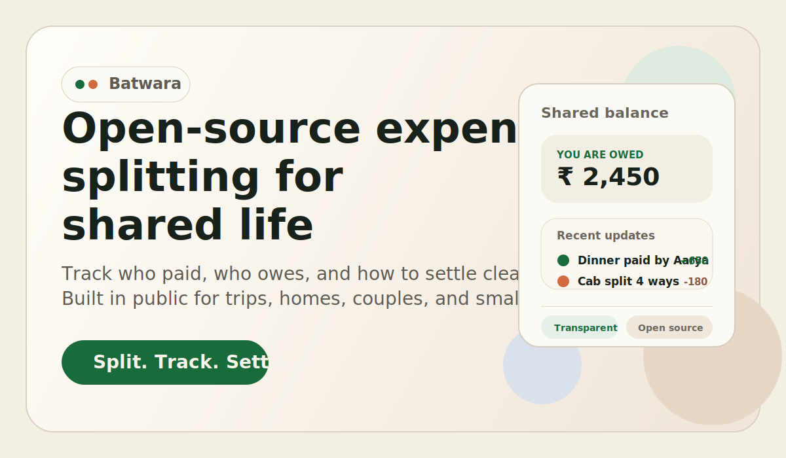

# Batwara



Batwara is an open-source expense splitting app for shared life.

It is being built for people who regularly spend together and need a calmer, clearer way to track shared expenses, understand balances, and settle fairly. That includes trips, shared homes, couples, friend groups, and any small group managing money together.

## What Batwara Is

Batwara is a product in its early stage.

Right now, this repository contains the public landing page, the design direction, and the application foundation we will build on. The core product experience is not finished yet. There is no full expense workflow yet, no group management flow, and no production-ready backend features in this repository today.

That is intentional.

We are opening the project early so the vision, product direction, interface decisions, and technical foundation can evolve in public. If you join now, you are not arriving after the important decisions have already been made. You can help shape them.

## Why We Are Building It

Shared expenses are common, but the experience around them is often noisy, awkward, or harder than it should be.

People do not just want a calculator. They want confidence. They want to know:

- who paid
- who owes what
- what is fair
- how to settle with the fewest surprises

We are building Batwara to make that experience feel more human.

The goal is not only to split bills. The goal is to make shared money feel understandable, transparent, and less stressful.

The project is also open source because that matters for this kind of product. Money-related tools benefit from transparency. People should be able to inspect the code, contribute improvements, self-host in the future, and understand how the product is evolving.

## Project Goals

Batwara is being designed around a few clear goals:

- Make shared expenses easy to understand at a glance.
- Keep the product calm, clean, and trustworthy instead of noisy or overly financial-looking.
- Support real group scenarios such as trips, roommates, couples, and recurring shared expenses.
- Make balances and settlement paths obvious.
- Build in public with a transparent open-source foundation.
- Keep the product accessible to contributors from the beginning, not after the architecture is already locked in.

## Current Status

Batwara is just getting started.

What exists today:

- A public landing page with the first Batwara brand and design direction
- Server-rendered React app foundation using TanStack Start
- Early SEO, metadata, sitemap, and open-source messaging
- Early performance and environment toggles for homepage visuals

What does not exist yet:

- Authentication
- Group creation and member management
- Expense entry and editing flows
- Balance summaries and settlements
- Database and production backend workflows
- Complete contributor guides and issue templates

This README is written to match the current reality of the repository, not the final vision.

## What We Plan to Build

The product direction is already clear even though the implementation is early.

Planned areas of work include:

- Shared group expense tracking
- Flexible bill splitting flows
- Clear group balances and settlement suggestions
- Better support for recurring shared life scenarios
- Self-hosting-friendly architecture
- Contributor-friendly open development

The near-term focus is simple: turn the current landing page and app foundation into a real product surface that contributors can build on together.

## Quick Start

Batwara currently runs as a Bun-based local development app.

### Prerequisites

You should have:

- Bun installed
- A modern Node-compatible local environment

If you already use Bun, that is enough for the current repo.

### Install dependencies

```bash
bun install
```

### Create your local environment file

Copy the example file:

```bash
cp .env.example .env
```

Current environment variables:

- `VITE_APP_URL`
  - Absolute app URL used for canonical URLs, sitemap generation, and metadata
- `VITE_ENABLE_DEVTOOLS`
  - Enables TanStack devtools locally when set to `true`
- `VITE_ENABLE_INTERACTIVE_BACKGROUND`
  - Enables the animated pointer-reactive background
- `VITE_ENABLE_HERO_SCENE`
  - Enables the homepage Three.js hero scene
- `VITE_ENABLE_HERO_SCENE_ON_MOBILE`
  - Allows the hero scene to load on mobile devices

The default example values are safe for local development.

### Start the development server

```bash
bun run dev
```

The app runs on:

```text
http://localhost:3000
```

## Available Scripts

Use these commands during local development:

- `bun run dev`
  - Start the local development server
- `bun run build`
  - Create a production build
- `bun run preview`
  - Preview the production build locally
- `bun run typecheck`
  - Run TypeScript without emitting files
- `bun run lint`
  - Run ESLint across the project
- `bun run test`
  - Run the current test command

## Tech Stack

Batwara currently uses:

- TanStack Start
- React
- TypeScript
- Vite
- Tailwind CSS
- Three.js with React Three Fiber for landing-page visuals

This stack will evolve as backend and product features are added, but the current foundation is already set up for a full-stack React application.

## Contributing

We are opening Batwara early because early contribution is valuable.

If you want to help, this is a good time to join:

- the product direction is still taking shape
- the architecture is still young
- the first core features are still ahead of us

Ways to contribute right now:

- improve the landing page
- refine the design system
- help shape the product direction
- improve documentation
- suggest architecture decisions before implementation hardens
- prepare the foundation for auth, groups, expenses, and backend features

If you plan to contribute code, start by running the project locally and reading through the current landing page, routes, and supporting docs in the repository.

## Open Source

Batwara is being built as an open-source project from the beginning.

That is not a branding choice. It is part of the product philosophy.

We want the project to be:

- transparent in how it works
- open to community contribution
- easier to trust and inspect
- capable of growing with public feedback instead of behind closed doors

The repository is being prepared for its first public push now. The current codebase is early, but that is exactly why this is a useful time to publish it.

## License

A project license has not been added to the repository yet.

Before the first public release on GitHub, this repo should include a proper `LICENSE` file so contributors and users know exactly how Batwara can be used, modified, and shared.

## Roadmap

Near-term priorities:

1. Stabilize the public project foundation
2. Improve documentation and contributor onboarding
3. Add the first real product flows
4. Introduce backend and data-layer building blocks
5. Start shaping Batwara into a usable open-source expense sharing product

## Repository Note

This repository is intentionally early-stage.

If you are visiting from GitHub after the first public push, expect a project that has a clear direction but is still in its foundation phase. The landing page is real. The product vision is real. The implementation is just beginning.
